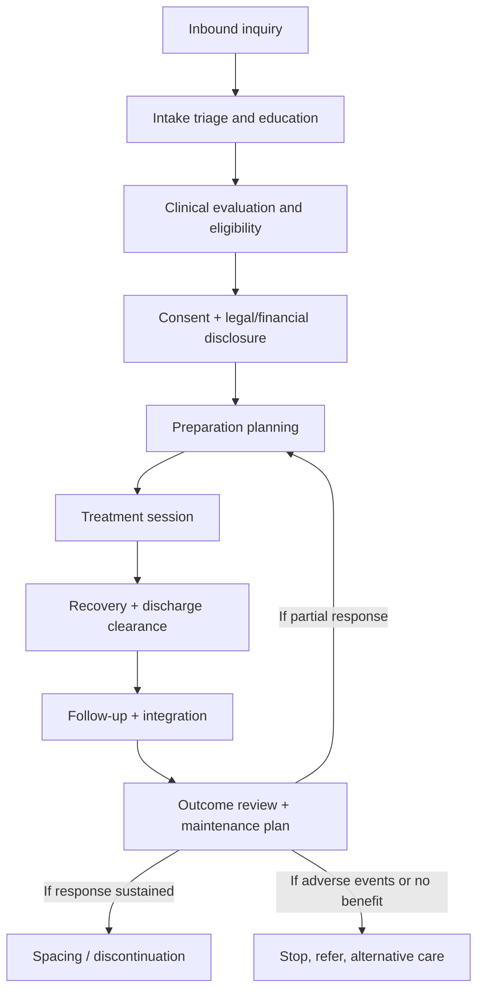

# Provider-View Operations for Psychedelic Therapy Treatments

## Executive summary

Licensed clinics running ketamine and other regulated programs succeed or fail on operational discipline, not on marketing. The provider-side outcomes that matter in B2B terms are: predictable safety, defensible documentation, repeatable workflows, measurable outcomes, and reimbursement-ready records. The strongest public “gold standard” pattern is a sedation-adjacent medical workflow with (1) rigorous pre-treatment screening, (2) standardized monitoring and emergency readiness, (3) measurement-based care with defined stop and pause thresholds, and (4) structured follow-up and integration. citeturn13view0turn33view0turn30view0turn8view0turn5search4

For ketamine clinics, authoritative guidance converges on: treat only appropriately selected patients, monitor blood pressure, heart rate, oxygenation, and level of consciousness before, during, and after dosing, have Advanced Cardiac Life Support capability on-site, and document “time-out,” dose, route, infusion settings, adverse events, and discharge safety. citeturn13view0turn33view0turn30view0turn9view0turn9view1

For regulated psilocybin programs, the workflow is regulation-driven and documentation-heavy. In entity["state","Oregon","us state"], psilocybin services are explicitly not “medical treatment” in the program’s informed consent, the model is “non-directive,” and required client forms and operational rules govern intake, transportation planning, safety/support planning, product transfer, minimum session durations, facilitator ratios for group sessions, adverse reaction reporting, and release criteria. citeturn18view0turn35search6turn14view0turn19view0turn19view1turn35search1turn35search9turn21view0turn20view0

For entheogenic religion operators seeking legitimacy and legal protection, the business transformation is from “informal ceremony” to “auditable compliance system.” The public record shows that federal religious exemptions under the Religious Freedom Restoration Act are procedurally complex, and stakeholders report barriers and uncertainty. You should expect high legal overhead, strict governance needs, and a long runway to stable legitimacy. citeturn2search5turn2search6turn2search8

## Regulatory and business models that shape workflow

A licensed ketamine clinic operates in a medical model with a federally scheduled controlled substance. Ketamine is identified by the entity["organization","Drug Enforcement Administration","drug law enforcement, us"] and DEA Diversion materials as a Schedule III controlled substance, which drives secure storage, prescribing controls, and diversion risk management. citeturn27search0turn27search4turn27search7

A “regulated psilocybin services” operator is typically not running a medical practice model, even if medical professionals participate in parts of the workflow. In Oregon’s program, informed consent explicitly states services are not medical or clinical treatment, while acknowledging federal Schedule I status. citeturn18view0turn15view1

A key practitioner-facing change in Oregon beginning in 2026 is “dual licensure,” allowing facilitators who also hold certain professional licenses to provide health care or behavioral health services during preparation and integration sessions, but not during the administration session. This creates a hybrid B2B model where the business can offer clinically oriented prep and integration while keeping administration non-directive and within the program’s scope. citeturn14view0turn22view0turn22view1turn21view3

In entity["state","Colorado","us state"], the natural medicine framework is also governance-driven, with healing centers required to maintain administration session logs, adverse-event reporting, and emergency plans, and with informed-consent and termination-process requirements spelled out in state regulations. citeturn26view1turn26view0turn23search2

Reimbursement reality is central to “practitioner pain.” Major payers frequently classify IV ketamine for depression as investigational or not established, which pushes clinics toward cash-pay or complex out-of-network strategies. entity["company","Aetna","us health insurer"], for example, states ketamine-assisted therapy is experimental/investigational/unproven for depression in its clinical policy bulletin. citeturn12search0 A entity["company","Blue Cross Blue Shield of Massachusetts","us health insurer, ma"] policy similarly labels IV ketamine for mental health as investigational in many situations. citeturn12search1 In contrast, esketamine has an FDA-approved labeling and a REMS that creates a clearer operational standard, which is why it is often more reimbursable, even though it imposes monitoring and documentation burdens. citeturn5search0turn5search4turn12search2

## Phase-based clinical operations and controls

This section is written as an operational “provider playbook,” with differences called out for ketamine clinics versus regulated psilocybin services.

This flow reflects the standard operating procedure emphasis in ketamine consensus guidance, sedation guidelines, and regulated program rules that require preparation, administration, and integration sessions, plus discharge and follow-up. citeturn13view0turn33view0turn8view0turn35search6turn21view0

### First contact, intake, and evaluation

Core B2B objective: convert an inquiry into a medically and legally defensible “go/no-go” decision while minimizing clinician time spent on ineligible patients.

Intake actions and workflow controls  
For ketamine clinics, a “pre-admission evaluation” approach is recommended so you can complete work-up days to weeks before treatment day, not in the chair. This includes treatment resistance verification, psychiatric assessment, medical comorbidity screening, and indicated testing. citeturn30view0turn33view0turn13view0 For regulated psilocybin services in Oregon, rules require a preparation session at least 24 hours and no more than 90 days before the first administration session, with required forms and written consents completed before administration. citeturn35search6turn18view0turn14view0

Personnel roles  
A typical ketamine clinic team in public guidance includes: a prescribing clinician with controlled-substance authority and ACLS capability, registered nurses monitoring during and after treatment, and access to psychiatric evaluation for behavioral risks prior to discharge. citeturn13view0turn31view0turn33view0 In regulated Oregon psilocybin services, the licensed facilitator is the primary contact across preparation, administration, and integration, and the facilitator role is defined as non-directive during administration. citeturn22view1turn18view0turn14view0

Screening tools and practical thresholds  
For ketamine, major public clinical recommendations include baseline vital sign assessment and defined blood pressure thresholds. CANMAT recommends not initiating infusion if baseline blood pressure is greater than 140/90 and pausing the infusion if blood pressure rises above 160/100, resuming when below that threshold, with or without antihypertensive treatment. citeturn33view0turn35search11 The entity["organization","College of Physicians and Surgeons of British Columbia","medical regulator, british columbia"] standard requires obstructive sleep apnea screening using a validated tool such as STOP-Bang during pre-admission assessment. citeturn31view4turn34search3

For regulated psilocybin services in Oregon, the Client Information Form creates bright-line exclusions and escalation triggers. “Yes” to lithium use in the last 30 days or current thoughts of harming self or others or history/diagnosis of active psychosis bars participation in an administration session. Other “yes” answers trigger consultation encouragement and planning requirements (medications, interpreter needs, mobility devices, support person plans). citeturn14view0

Recommended measurement-based intake for licensed clinics is to operationalize symptoms, function, and risk using validated tools. In publicly visible clinic routines described by patients, it is common to complete PHQ-9 and GAD-7 at each visit and attach physiologic monitoring before dosing. citeturn36search0turn34search0turn34search5 PHQ-9 score bands and cutpoints are widely published and support severity stratification. citeturn34search0turn34search20

Medical and psychiatric risk checks  
Ketamine guidance consistently elevates cardiovascular risk, psychosis/mania risk, substance use disorder, pregnancy/breastfeeding, and unstable medical conditions as key concerns. CANMAT lists relative contraindications including psychotic symptoms, poorly controlled hypertension, unstable medical conditions, substance use/dependence, and pregnancy/breastfeeding, and recommends ECG and urine toxicology when indicated. citeturn33view0turn30view0 The APA ketamine consensus statement highlights the need to manage cardiovascular and behavioral risks, and to ensure on-site evaluation for suicidal ideation before discharge. citeturn13view0turn27search0

Consent and legal documentation  
For ketamine, informed consent should be explicit about off-label use, risks, alternatives, and the likelihood of needing maintenance rather than cure. citeturn13view0turn7view0 The CPSBC standard even addresses “rolling consent” across repeated consecutive visits, requiring documentation that consent remains valid at each visit. citeturn30view0

For Oregon psilocybin services, required documents include an informed consent form, Client Bill of Rights, product potency information discussion, a transportation plan, and a safety and support plan, and there are rules about what must be reviewed in preparation. citeturn18view0turn15view0turn15view1turn35search6turn19view0turn19view1

Common operational pain points in this phase  
For ketamine clinics: the biggest friction is the gap between what good medicine requires and what payers reimburse. Professional guidance explicitly connects cost pressure and lack of coverage to the rise of less supervised at-home protocols, with associated misuse and diversion concerns. citeturn11view0turn12search0turn12search3 For psilocybin facilitators in Oregon: practitioners and clients frequently express frustration that the model is non-directive and not “therapy,” alongside concerns about high licensing fees and limited ability to integrate mental health treatment during administration. citeturn22view1turn36search11turn18view0

### Treatment session

Core B2B objective: deliver a repeatable session that is safe, monitored, and documented to a standard you can defend in audits, claims, and complaints.

Physical setting and setup  
Ketamine clinics commonly use a private, low-stimulation room with a recliner or bed space, plus continuous physiologic monitoring. This aligns with published facility requirements that each treatment space be equipped with automatic blood pressure monitoring, pulse oximetry, suction, oxygen, bag-valve-mask device, and airway equipment, with cardiac monitoring available. citeturn31view0turn31view3turn9view1

Psychedelic session “set and setting” in classic hallucinogen research emphasizes a comfortable room, prolonged observation, and trained monitors. The entity["organization","Johns Hopkins University","research university, maryland"] safety guidelines recommend at least two monitors present during administration, reflecting the “never alone” standard used in research environments. citeturn3search1turn3search4

Personnel roles during session  
For ketamine, consensus statements emphasize that clinicians delivering treatment should be prepared to manage cardiovascular events, monitor physiologic and mental status, and respond to behavioral emergencies. citeturn13view0turn33view0turn7view0 The CPSBC standard specifies that registered nurses monitoring ketamine patients must be qualified and ACLS-trained. citeturn31view0

For Oregon psilocybin administration sessions, the facilitator is required to remain responsible for monitoring and support until safe release, and service center licensee representatives have defined operational roles. citeturn15view0turn21view0turn3search2

Monitoring equipment and protocols  
A robust ketamine clinic protocol borrows from moderate sedation safety design. The entity["organization","American Society of Anesthesiologists","us anesthesia society"] 2018 moderate procedural sedation guidelines emphasize monitoring ventilation and oxygenation using clinical observation plus pulse oximetry and capnography, hemodynamic monitoring including blood pressure and heart rate, contemporaneous recording, and the availability of someone capable of airway rescue, with suction and oxygen immediately available. citeturn9view0turn9view1turn9view2

Ketamine-specific guidance adds explicit post-infusion monitoring durations. CANMAT recommends monitoring blood pressure, heart rate, oximetry, and level of consciousness before and during infusions and for at least 1 hour post-infusion. citeturn33view0turn35search11 The CPSBC standard describes minimum monitoring documentation points (baseline, 5 minutes into infusion, mid-infusion, end-infusion, and 1 hour post-infusion) and minimum length of stay (60 minutes in the treatment area after infusion discontinuation). citeturn31view1turn31view3

Dosing rationale and administration steps  
For ketamine clinics, the most commonly cited depression protocol is a subanesthetic, weight-based dose delivered IV over 40 minutes. The APA consensus statement describes 0.5 mg/kg over 40 minutes as the typical dose used in mood disorder studies and highlights that this dose can raise blood pressure and heart rate. citeturn13view0 CANMAT similarly lists 0.5 mg/kg over 40 minutes as the typical protocol, often repeated 2 to 3 times per week for 4 to 8 infusions. citeturn33view0 The CPSBC standard requires infusion control devices with locked control panels, a dedicated line, continuous infusion only (no bolus), and an independent double-check of infusion settings. citeturn30view0turn31view1

For IM and oral/sublingual ketamine, the evidence base is weaker and operational risk increases because onset and bioavailability are more variable. CANMAT rates oral ketamine evidence as limited and recommends that non-IV formulations be used only by specialists with ketamine-prescribing expertise, while warning about misuse and diversion. citeturn33view0turn11view0

For regulated Oregon psilocybin services, the workflow is explicitly documented: products are tested, packaged, and labeled before transfer to a service center, and the client’s consumption is observed, with maximum dose and minimum session durations defined in rules and program documents. citeturn15view1turn35search1turn3search2 The operational product and end-of-session form requires documentation of product type, dosage, quantity, unique identifier, and whether primary and secondary doses were consumed, and requires a signed release at the end of session with explicit release criteria. citeturn21view3turn21view0

Safety, emergency procedures, and harm reduction  
Ketamine: stop and pause triggers should be pre-written, not improvised. CANMAT provides specific blood pressure do-not-start and pause thresholds. citeturn33view0 Facilities should have emergency equipment and medications available consistent with sedation-risk profiles, including oxygen delivery, suction, airway tools, and emergency medications. citeturn9view1turn31view3

Oregon psilocybin: service centers must have safety and emergency plans including evacuation and emergency response procedures, and facilitators and staff must contact emergency medical services when there is an immediate or potential life threat, then notify the authority within required timeframes. citeturn4search0turn3search3turn3search7turn20view0 Additionally, clients are prohibited from driving after sessions and must follow pre-arranged transportation plans, with escalation to emergency services if safety issues cannot be resolved. citeturn19view0turn15view1turn18view0

Data capture during session  
For ketamine, measurement-based care recommendations explicitly include outcome rating scales plus monitoring dissociative symptoms using validated tools such as the Clinician-Administered Dissociative States Scale (CADSS) and modified Brief Psychiatric Rating Scale (BPRS), with monitoring at baseline, midpoint, endpoint, and 1 hour post-infusion. citeturn33view0turn35search11 For esketamine, REMS materials require monitoring for at least 2 hours for sedation, dissociation, and respiratory depression using pulse oximetry and vital signs, reinforced in prescribing information. citeturn5search4turn5search0turn5search12

Billing and reimbursement touchpoints during treatment  
A practical B2B rule is that reimbursement follows documentation, and documentation follows standardization. Esketamine has more defined billing pathways, including Medicare billing and coding guidance, because it is FDA-approved and tied to REMS program operational requirements. citeturn12search2turn5search4turn5search0

For IV ketamine, reimbursement is inconsistent and frequently denied as investigational in payer policies, which is why some organizations have issued position statements advocating for coverage. citeturn12search0turn12search1turn12search3 Some Medicaid programs publish detailed billing instructions for IV ketamine infusion therapy, including drug code usage and infusion administration code timing rules, illustrating how sensitive payment can be to coding mechanics. citeturn12search10

### Post-treatment and integration

Core B2B objective: translate an acute drug session into durable outcomes and reduce downstream risk, including relapse, adverse events, complaints, and poor reviews.

Immediate recovery and discharge clearance  
For ketamine, discharge should not rely on a patient saying they feel fine. CANMAT recommends discharge only after physiologic measures and mental state return to baseline. citeturn33view0 The CPSBC standard requires physician assessment just prior to discharge to evaluate behavioral risks including suicidal ideation, and advises patients not to drive or operate hazardous machinery for at least 24 hours after ketamine administration. citeturn31view1

For Oregon psilocybin, release requires that minimum session duration is met based on total psilocybin analyte consumed, that both client and facilitator are comfortable ending the session, and that the client agrees to follow the transportation plan. citeturn21view0turn19view0

Integration sessions and follow-up cadence  
For ketamine, there is no single mandated integration model, but multiple authorities encourage psychotherapy when possible, particularly for trauma and anxiety presentations, and emphasize rapid follow-up availability when psychiatric symptoms worsen. citeturn13view0turn7view0turn33view0 In provider and patient discourse, “integration” language is very common and often framed as using the post-session “plasticity window” for behavioral change, journaling, mindfulness, and processing. citeturn36search6turn36search2

For Oregon psilocybin services, the program operational form requires that facilitators attempt to contact clients within 72 hours of the conclusion of an administration session to offer integration information and other services, and adverse reactions within 72 hours post-release are explicitly tracked as “post-session reactions.” citeturn21view0turn20view0

Quality assurance and incident learning  
Sedation-adjacent standards emphasize quality improvement processes, not just clinical technique. The ASA sedation guidelines call out creation and implementation of quality improvement processes for moderate sedation. citeturn8view0turn9view0 The CPSBC standard requires quality improvement strategies and a quality performance program to monitor, evaluate, and improve services. citeturn30view0turn31view1 For Oregon psilocybin services, rule-based forms, record retention, and reporting structures create auditability, and the informed consent includes explicit misconduct reporting duties. citeturn18view0turn20view0turn22view1

### Repeat cycles and discontinuation

Ketamine repeat cycles  
Evidence summaries acknowledge rapid but often transient effects after single IV ketamine infusions, with relapse common within about 10 days for many patients, which is why repeated induction series and maintenance spacing are widely practiced, though longer-term efficacy evidence is still limited. citeturn33view0turn13view0 Standardized induction patterns in public guidance include 4 to 8 infusions, 2 to 3 times per week, with maintenance determined case by case. citeturn33view0turn30view0turn7view0

Psilocybin repeat cycles in regulated programs  
Oregon’s informed consent explicitly states that risks and benefits of repeated psilocybin use are unknown, and the program documents caution that risks and benefits above certain dose thresholds are unknown. citeturn18view0turn15view1 Operationally, Oregon rules allow “secondary doses” within an administration session, capped by a maximum total analyte amount, with storage, consent requirements, and documentation of unused product. citeturn21view3turn3search2

Discontinuation criteria  
Across models, the defendable stop rules are: lack of benefit after a pre-defined trial, intolerable adverse events, emerging mania/psychosis or unsafe behaviors, inability to comply with transportation or safety planning, and payer or legal noncompliance. This matches both ketamine safety guidance emphasizing behavioral risk monitoring and regulated program rules that hard-stop participation with certain risk markers. citeturn13view0turn33view0turn14view0turn18view0

## Protocol comparison tables

The tables below compare operationally relevant features, not just pharmacology. Where public sources do not provide a single universal rule, the table reflects consensus patterns and regulatory requirements.

### Ketamine route comparison for licensed clinics

| Dimension | IV ketamine in clinic | IM ketamine in clinic | Oral/Sublingual ketamine (clinic or hybrid) |
|---|---|---|---|
| Evidence strength for depression workflows | Strongest evidence base in consensus guidance and common research protocols. citeturn13view0turn33view0 | Limited evidence base relative to IV, with mixed study designs. citeturn13view0turn10search2turn10search6 | Limited evidence, higher variability, and higher misuse/diversion concern. citeturn33view0turn11view0turn10search3 |
| Administration control | Highest precision via infusion pump, with double-check and locked controls recommended in formal standards. citeturn30view0 | Less precise than IV; still requires medical supervision and monitoring given physiologic effects. citeturn35search3turn13view0 | Lowest precision due to variability in bioavailability and onset, making clinic-level standardization harder. citeturn11view0turn33view0 |
| Minimum monitoring pattern | Monitor vitals, oximetry, and consciousness before/during/at least 1 hour post; capnography recommended depending on sedation risk. citeturn33view0turn31view3turn9view0 | Similar monitoring expectations to IV in responsible practice due to BP and dissociation risk. citeturn13view0turn35search3 | Monitoring varies widely; professional concerns emphasize at-home risk and need for support person, safe environment, controlled prescribing. citeturn11view0turn33view0 |
| Common BP safety thresholds in public guidance | Do-not-start >140/90; pause/stop if >160/100 per CANMAT. citeturn33view0turn35search11 | No universal IM-specific threshold published broadly; clinics typically adapt IV thresholds. citeturn33view0turn35search3 | Same physiologic concerns exist; risk increases with patient noncompliance and variable absorption. citeturn11view0turn33view0 |
| Documentation “must-haves” | Dose, weight, route, infusion time, pump settings, vitals timeline, adverse events, discharge readiness, follow-up plan. citeturn13view0turn30view0turn33view0 | Dose, route, timing, vitals, adverse events, discharge safety, follow-up. citeturn13view0turn10search2 | Dose supplied, counseling, storage/diversion steps, follow-up intervals, adverse event escalation rules. citeturn11view0turn33view0 |
| Reimbursement posture | Frequently denied as investigational for depression by major payers, driving cash-pay reliance. citeturn12search0turn12search1 | Similar reimbursement issues to IV. citeturn12search0turn12search1 | Often positioned as compounded/off-label, increasing payer and regulator scrutiny. citeturn11view0turn12search0 |

### Psilocybin delivery model comparison

| Dimension | Ceremonial or entheogenic model | Regulated psilocybin program model |
|---|---|---|
| Legal posture in the U.S. | Federal Schedule I, with some groups seeking Religious Freedom Restoration Act accommodations; process is complex and uncertain. citeturn2search5turn2search8turn27search1 | State-regulated models exist, but federal Schedule I status remains, creating cross-jurisdiction complexity. citeturn15view1turn18view0 |
| Provider role definition | Often framed as “facilitator/guide” with set-and-setting emphasis; best public safety guidance comes from human hallucinogen research safeguards. citeturn3search1turn3search4 | In Oregon, facilitator is non-directive during administration, with defined required prep and integration sessions and required forms. citeturn22view1turn35search6turn18view0 |
| Intake exclusions and triggers | Varies by operator; best-practice screening is not universally standardized in public sources. citeturn3search4turn2search5 | Oregon Client Information Form includes bright-line exclusions (recent lithium, active self-harm intent, active psychosis) and explicit planning triggers. citeturn14view0 |
| Session duration and release rules | Varies widely. citeturn3search4 | Oregon rules define minimum administration durations by analyte dose bands and require defined release criteria plus transportation plan compliance. citeturn35search1turn21view0turn19view0 |
| Adverse event governance | Often inconsistent, which becomes a legitimacy and liability exposure if seeking legal protection. citeturn2search5turn3search4 | Oregon has defined adverse reaction documentation categories, includes post-session reactions within 72 hours, and has reporting duties. citeturn20view0turn3search7turn18view0 |
| Data and privacy | Varies widely, often informal. citeturn2search5turn3search4 | Oregon includes client rights, confidentiality rules, and opt-out constructs for de-identified data; client-facing forms reflect these. citeturn15view0turn18view0 |

## Measurement and documentation toolkit

This section provides templates you can adapt. Where a regulated program mandates a specific form, use the mandated version and treat the templates below as internal checklists.

### Sample measurement schedules

Ketamine clinic measurement schedule aligned to published guidance  
The scheduling below aligns with CANMAT’s recommended monitoring timepoints and measurement-based care approach, plus common validated tools used in practice. citeturn33view0turn34search0turn34search5turn34search10

| Timepoint | Physiologic monitoring | Patient-reported outcomes | Clinician-rated safety checks |
|---|---|---|---|
| Screening visit (days to weeks prior) | Baseline vitals; consider ECG and labs when indicated; OSA screen via STOP-Bang. citeturn33view0turn31view4turn30view0 | PHQ-9, GAD-7 baseline; functional baseline. citeturn34search0turn34search5 | Suicidality assessment tool such as C-SSRS if risk present; substance use assessment. citeturn34search10turn33view0 |
| Treatment day, pre-dose | Blood pressure, heart rate, oximetry, level of consciousness. citeturn33view0 | PHQ-9 and GAD-7 if doing session-by-session tracking. citeturn36search0turn34search0 | Clearance checklist: no new contraindications, no intoxication, ride confirmed, consent confirmed. citeturn13view0turn30view0 |
| During infusion | Monitor BP, HR, oximetry, consciousness; consider capnography if sedation risk. citeturn33view0turn9view0turn31view3 | Brief tolerability prompts (nausea, anxiety). citeturn33view0turn35search11 | Dissociation/psychotomimetic symptoms via validated scale when feasible. citeturn33view0turn35search11 |
| 1 hour post-infusion minimum | Continued vitals monitoring and discharge readiness assessment. citeturn33view0turn31view3 | Quick global improvement rating; plan for next session. citeturn33view0turn7view0 | Screen for suicidal ideation and severe behavioral effects prior to discharge. citeturn13view0turn31view1 |
| 24 to 72 hours after | Telehealth or async check-in for adverse effects and symptom change. citeturn13view0turn11view0 | Repeat PHQ-9 and targeted goal tracking. citeturn34search0 | Escalate if worsening mood, suicidality, mania, or substance misuse signals. citeturn13view0turn33view0 |
| End of induction series | Review outcomes and decide maintenance spacing or discontinuation. citeturn33view0turn7view0 | Trend PHQ-9 and function; define response and remission. citeturn34search0turn33view0 | Document rationale for maintenance or stopping. citeturn33view0turn13view0 |

Oregon regulated psilocybin services measurement schedule aligned to required operational steps  
Oregon’s program is defined around preparation, administration, integration sessions, plus post-session reaction tracking. citeturn18view0turn35search6turn21view0turn20view0

- Preparation session: complete and sign Client Information Form, transportation plan, safety and support plan, and review informed consent and Client Bill of Rights. citeturn35search6turn14view0turn19view0turn19view1turn18view0turn15view0  
- Administration session: document product transfer and end-of-session release criteria, including minimum duration rules and transportation compliance. citeturn21view3turn35search1turn21view0turn19view0  
- 72-hour window: attempt post-session contact for integration info and track post-session reactions that involve emergency services or medical care. citeturn21view0turn20view0

### Suggested documentation templates and checklists

Ketamine clinic intake checklist template  
This template reflects consensus guidance priorities: TRD verification, medical risk screening, informed consent, and safety planning. citeturn33view0turn13view0turn30view0

- Referral story: diagnosis, duration, prior treatments, TRD criteria met, current meds. citeturn33view0turn30view0  
- Contraindication screen: psychosis history, mania history, uncontrolled hypertension, unstable cardiac/respiratory disease, pregnancy/breastfeeding, substance use disorder. citeturn33view0turn11view0  
- Baseline testing when indicated: ECG, urine toxicology, renal and liver function; OSA screening (STOP-Bang). citeturn33view0turn31view4turn30view0  
- Consent packet: off-label disclosure, benefits/limits, risks (BP, dissociation), alternatives, maintenance likelihood, no-driving rule, transport requirement. citeturn13view0turn7view0turn31view1  
- Operational plan: induction schedule, monitoring plan, emergency readiness, integration plan, outcomes tracking plan. citeturn33view0turn8view0

Ketamine infusion day “time-out” template  
The APA consensus statement recommends site-specific standard operating procedures including baseline vitals, confirmation of correct dosing parameters, and stopping criteria. citeturn13view0turn30view0

- Patient identity confirmed, indication confirmed, consent confirmed as current. citeturn30view0turn13view0  
- Baseline vitals documented and within your policy thresholds. citeturn33view0turn13view0  
- Dose calculation verified, pump settings verified, independent double-check completed. citeturn30view0  
- Monitoring devices on, alarms set, emergency equipment ready, rescue plan known to staff. citeturn9view1turn31view3turn8view0  
- Stop criteria reviewed: BP thresholds, airway compromise, severe agitation, dissociation outside expectations. citeturn33view0turn13view0  
- Transport confirmed: no driving for at least 24 hours per conservative standards. citeturn31view1turn13view0

Oregon psilocybin services internal compliance checklist  
This is not a substitute for program forms, it is a “do not miss” audit list built from OPS rules and forms. citeturn35search6turn18view0turn14view0turn21view0turn20view0

- Preparation session completed 24 hours to 90 days prior; all required forms signed. citeturn35search6turn14view0turn18view0  
- Transportation plan completed and excludes self-operated transportation. citeturn19view0turn35search2  
- Safety and support plan completed; emergency contact documented; plan not modifiable during administration. citeturn19view1turn18view0  
- Product potency information reviewed; client dose plan documented; maximum and session duration rules followed. citeturn15view1turn35search1turn21view3  
- Administration session product transfer and end-of-session release forms completed; facilitator and client both comfortable; transport compliance confirmed. citeturn21view0turn19view0  
- Adverse reactions documented as required; emergency services reporting duties met; post-session reactions tracked within 72 hours. citeturn20view0turn3search7

## Voice of customer, FAQs, and search language map

This VoC synthesis uses a qualitative frequency rubric based on recurrence across official forms, consensus guidance, and high-activity public discussions. “High” means it appears consistently across multiple authoritative sources and/or repeated practitioner and patient discussions.

### High-frequency practitioner and patient phrases

Ketamine clinic language  
- “We monitor blood pressure, pulse ox, and heart rate.” citeturn33view0turn31view3turn36search0  
- “You need a ride home, no driving after.” citeturn13view0turn31view1turn11view0  
- “We track outcomes with PHQ-9 and GAD-7.” citeturn34search0turn34search5turn36search0  
- “Blood pressure too high, we pause or stop.” citeturn33view0turn35search3turn36search8  
- “Insurance usually doesn’t cover IV ketamine.” citeturn12search0turn12search1turn36search9

Oregon psilocybin facilitator language  
- “Non-directive support, no diagnosis, no interpretation.” citeturn22view1turn36search7turn18view0  
- “Transportation plan required, no driving after.” citeturn19view0turn18view0turn15view1  
- “We have a safety and support plan and an emergency contact.” citeturn19view1turn18view0  
- “Minimum session duration depends on dose.” citeturn35search1turn15view1turn21view3

### Common FAQs that drive conversions and reduce cancellations

Patient-facing FAQs that clinics should answer early  
- “What will you monitor during my session?” Patients commonly expect ECG leads, blood pressure cuff, and pulse oximetry in clinics. citeturn36search0turn33view0  
- “How long do I have to stay after?” Esketamine is tied to at least 2 hours of observation under REMS, and ketamine infusion standards commonly require at least 1 hour post-infusion monitoring. citeturn5search4turn5search0turn33view0turn31view3  
- “Do I have to stop benzodiazepines or other meds?” CANMAT cautions that benzodiazepines and other sedatives may interfere with response or worsen sedation. citeturn33view0  
- “How many sessions will I need?” Patients commonly reference a 4 to 8 infusion induction course, which matches published consensus patterns. citeturn33view0turn30view0turn36search16  
- “What about integration?” Patients and practitioners speak frequently about journaling, mindfulness, processing, and therapy add-ons. citeturn36search2turn36search6turn36search18

Provider-facing FAQs (B2B pain points)  
- “What BP threshold do we use to pause?” CANMAT provides specific thresholds used in practice and cited in clinical discussions. citeturn33view0turn35search3  
- “What can we bill?” Psychiatrists discuss limitations of psychotherapy add-on billing for racemic ketamine encounters, and time-based billing strategies. citeturn36search1turn36search5  
- “How do we defend our protocol?” Sedation guideline alignment, SOPs, and quality improvement processes are core defensibility elements. citeturn8view0turn9view1turn13view0turn30view0

### Keyword sets and hashtags for SEO and practitioner acquisition

Short-tail keywords  
Ketamine clinic: “ketamine infusion clinic,” “ketamine protocol,” “ketamine monitoring,” “ketamine blood pressure threshold,” “ketamine adverse events,” “ketamine billing codes,” “esketamine REMS monitoring.” citeturn33view0turn5search4turn12search2turn12search10  
Regulated psilocybin: “psilocybin facilitator,” “psilocybin client information form,” “psilocybin transportation plan,” “psilocybin administration session duration,” “psilocybin adverse reaction form.” citeturn14view0turn19view0turn35search1turn20view0turn22view1

Long-tail keywords  
- “baseline blood pressure greater than 140/90 ketamine infusion not proceed” citeturn33view0turn35search11  
- “pause ketamine infusion blood pressure 160/100 resume when below threshold” citeturn33view0turn35search3  
- “ketamine infusion monitoring baseline midpoint endpoint 1 hour post infusion” citeturn33view0turn31view3  
- “Oregon psilocybin preparation session 24 hours 90 days required forms” citeturn35search6turn18view0  
- “Oregon psilocybin client information form lithium 30 days disqualify” citeturn14view0  
- “Oregon psilocybin minimum duration administration session 35 mg to 50 mg six hours” citeturn35search1turn15view1  
- “psilocybin facilitator non-directive approach meaning” citeturn22view1turn36search3  
- “healing center administration session log includes dose type intended outcome” citeturn26view1

Hashtags  
Ketamine clinics: #ketaminetherapy, #ketamineinfusion, #treatmentresistantdepression, #measurementbasedcare, #mentalhealthclinicoperations, #revenuecyclemanagement. citeturn12search0turn33view0turn36search1  
Regulated psilocybin: #psilocybinservices, #psilocybinfacilitator, #clientinformedconsent, #harmreduction, #nonDirectiveSupport, #integration. citeturn18view0turn22view1turn21view0

## Limits of public sources and legal and ethical constraints

Public data limits  
Many of the most operationally valuable details for clinics, such as exact staffing models, internal adverse-event analytics, payer contracting tactics, and proprietary integration protocols, are not publicly available. What is available tends to cluster into three buckets: consensus statements and guidelines, accreditation-style facility standards, and state regulatory forms and rules. citeturn13view0turn33view0turn30view0turn17view0turn26view1

Medical and legal scope constraints  
This report summarizes public guidance and regulations. It does not replace local law, licensure scope rules, institutional policies, or clinical judgment. Ketamine workflows involve controlled substance handling and medical risk. Psilocybin remains Schedule I federally, and state-regulated programs explicitly warn clients about federal status. citeturn27search1turn18view0turn15view1

Entheogenic religion operator constraints  
Federal religious exemptions for controlled substances involve RFRA-specific legal standards and DEA petitioning processes. The public record shows that the process exists but is challenging, and stakeholders report barriers to legal access and use under RFRA. Treat “legal protection and legitimacy” as a compliance program and legal strategy, not as a branding claim. citeturn2search5turn2search8turn2search6